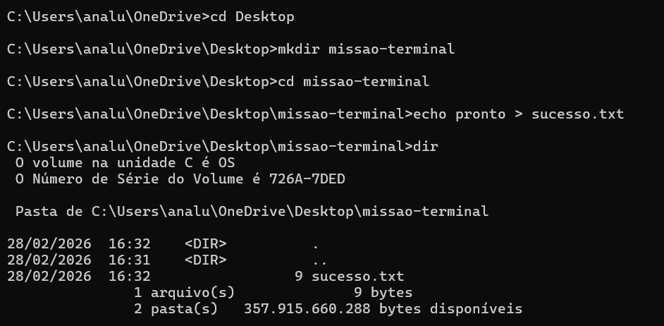

# ⚡ Meus Comandos Favoritos
Aqui estão os comandos que mais utilizei na aula de Terminal:

- `cd`: Para navegar entre pastas.
- `dir`: Para listar arquivos.
- `mkdir`: Para criar pasta.
- `echo`: Para criar arquivo.

  # O que eu fiz
  Eu abri o terminal, criei uma pasta  chamada missão-terminal, criei um arquivo chamado sucesso.txt e verifiquei se deu certo usando o comando dir.

  ## 💻 Hardware

`Processador(es): 1 processador(es) instalado(s)
[01]: Intel64 Family 6 Model 140 Stepping 1 GenuineIntel ~2419 Mhz`

## 📸 Evidência de Execução

